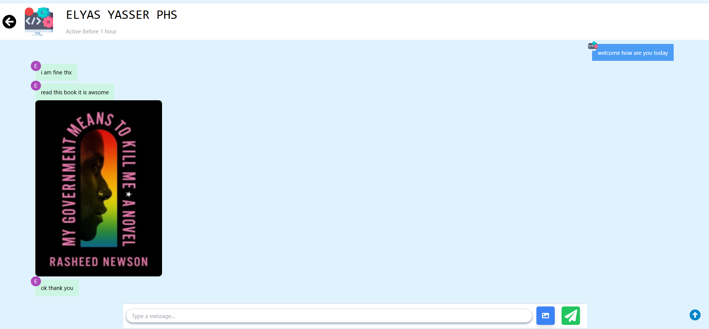

# Digital Chat

## Description
mern stack chat app   i make this app using rest api (polling) cannot handle real time updates.

It is “request-response”, so the server can only respond to a request. If a user sends a message to another user,
for authentication i use OAuth2 with clerck will be explained more in [Installation-and-Usage](#Installation-and-Usage)  if you interested see updated  version 

that i use websockets to handle real-time updates [digtal chat updated version](#chatting)    

## Table Of Contents
- [Digital Chat](#digital-chat)
  - [Description](#description)
  - [Table Of Contents](#table-of-contents)
  - [Installation-and-Usage](#installation-and-usage)
  - [Used-Techs](#used-techs)
  - [Contribution](#contribution)
## Installation-and-Usage
To get the project up and running locally:
1. Install [Node.js](https://nodejs.org/en/)

2. clone this repository by running in your cmd `git clone https://github.com/ELIASyASSER/chatApp.git`
  
4. now you will find two directories `frontend` and `backend` split your terminal and run `cd frontend` and in  second terminal run `cd backend` now run `npm install` in both of `frontend and backend directories`

5. you will find .env.example rename it to .env and replace variables inside it becasue i use OAuth2 with clerck

6. [see full documentation here how to know how to get these variables](https://clerk.com/blog/oauth2-react-user-authorization#get-your-google-client-id-and-secret) 

7. [now you will enter here to get your variables and put them](https://console.cloud.google.com/cloud-resource-manager)

8. finally run `npm run dev` in both `frontend` and `backend` direcotries

9. open your browser  **chrome_for_example** type `http://localhost:5173`

10. open your other account or other browser  **firefox_for_example type** `http://localhost:5173` **to start chatting between two users if you want to add more users enter to other browser and sign in** 

**if you want to publish this app to  github make sure to ignore `node_modules` and `.env` files because of secret data**   
## Used-Techs 
- React
- React-router-dom
- Node.js
- Express
- mongooose
- Tailwind.css
- react-icons
  
### Contribution
🤝
if there any issue or features leave an issue i will consider it [Issue Page]([issues/](https://github.com/ELIASyASSER/chatApp/issues))

or make [pull request here ](https://github.com/ELIASyASSER/chatApp/pulls)
